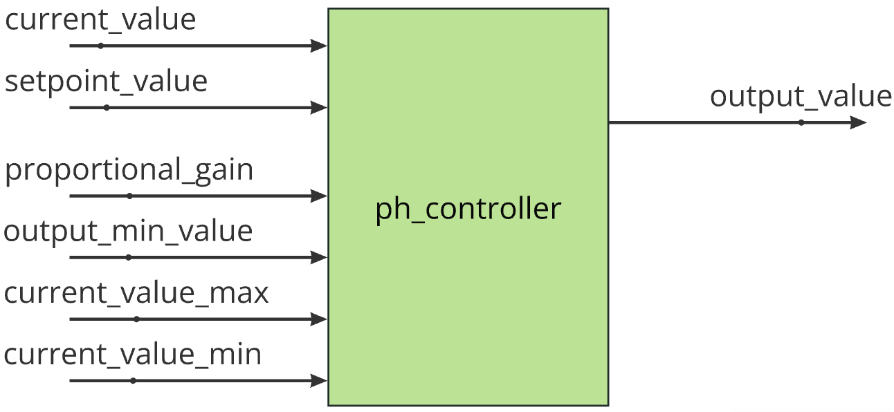

# Requerimientos

## Descripción del módulo

El modulo implementa un control tipo proporcional cuya entradas son:

- valor actual (`current_value`)
- setpoint (`setpoint_value`)
- ganancia proporcional (`proportional_gain`) de la variable controlada.
- salida mínima permitida (`output_value_min`)
- valor máximo de entrada (`current_value_max`)
- valor mínimo permitido (`current_value_min`)

## Requisitos

1. El módulo se debe poder iniciar.
2. El módulo se debe poder parar.
3. En el módulo se debe poder configurar:
   1. Setpoint: Valor deseado.
   2. Ganancia proporcional.
   3. Valor máximo de entrada.
   4. Valor mínimo de entrada.
   5. salida_minima: umbral de protección para evitar posibles encendidos "muy cortos".
4. El módulo debe validar los valores de configuración.
   1. `current_value_min` < `current_value_max`
   2. `current_value_min` <= `setpoint` <= `current_value_max`
   3. `proportional_gain` > 0
5. El módulo debe indicar si falla la configuración, indicando el motivo.
6. Antes de iniciar, el módulo debe ser configurado correctamente.
7. Sólo se podrá cambiar la configuración del módulo cuando el mismo no esté controlando (actualización en caliente). Se deberá parar para poder hacerlo.
8. _**Cálculo del error del control**_: El módulo debe calcular el error como la diferencia entre el setpoint (`setpoint_value`) y el valor actual (`current_value`) sólo si el valor actual es mayor al setpoint.
9. _**Cálculo de la salida proporcional**_: El módulo debe calcular la salida proporcional basada en el error, escalándola a un rango de 0 a 100% según una ganancia Kp.
10. _**Saturacion de la salida**_: El valor de la salida debe estar saturado en el rango [0, 100].
    1. Si `output_value` < 0%, `output_value` = 0%.
    2. Si `output_value` > 100%, `output_value` = 100%.
11. _**Protección de salida mínima**_: Si la salida calculada es menor que `output_min_value`, el módulo debe forzar la salida a 0%. Se debe respetar la salida calculada solo si alcanza o supera `output_min_value`.
